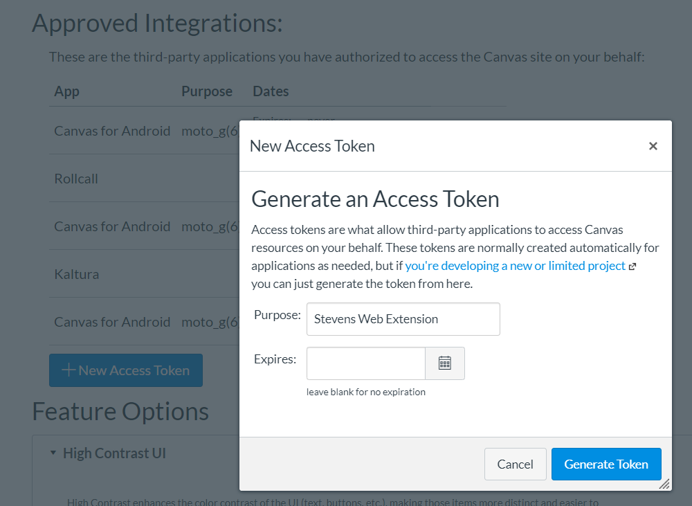

_References_

-   [Canvas API](https://canvas.instructure.com/doc/api/)
-   [JavaScript Fetch](https://developer.mozilla.org/en-US/docs/Web/API/Fetch_API/Using_Fetch)

# Using Canvas API

Canvas provides an open-source REST API (type of API which allows for managing state between a client and server). In order to use an API that involves interacting with accounts, some form of authentification is generally required. Canvas has an Authorization Token that can be activated on your Canvas page. This can be found by clicking on your picture in the sidebar > Settings > Approved Integrations > New Access Token.

Enter the name of the token, and leave the `Expires` field blank and create the token. Make sure to save this token somewhere private, as it is the equivalent of giving somebody full control over your Canvas account.

**I: Retrieve your Courses**

The first part of this challenge is to use the Canvas API to access your course data. Make a request to the API according to the documentation and then use `console.log()` to display the output.

<details>
    <summary>Hint 1</summary>
    JavaScript has a built-in <code>fetch()</code> function which takes a URI and optional parameters. Use this to query the Canvas API.
</details>
<details>
    <summary>Hint 2</summary>
    The query you should use is <code>GET /api/v1/courses</code>.
</details>

**II: Show Assignments by Course**

Take the course data that you received from the first part of the challenge, and iterate through them and show the upcoming assignments for each course. _Ideally_, the resulting object should look something like this:

```
{
    "BT 321": [
        {...} // assignments
    ],
    "CS 385": [
        {...} // assignments
    ],
    ...
}
```

<details>
    <summary>Hint 1</summary>
    The query you should use is <code>GET /api/v1/courses/:course_id/assignments</code>. Replace <code>:course_id</code> with each course ID you received previously.
</details>
<details>
    <summary>Hint 2</summary>
    The query takes a <code>bucket</code> parameter for which the string <code>"upcoming"</code> is a possible value. Add <code>?bucket=upcoming</code> to the URI. Additionally, you can sort them in order of due date by adding <code>&order_by=due_at</code>.
</details>
